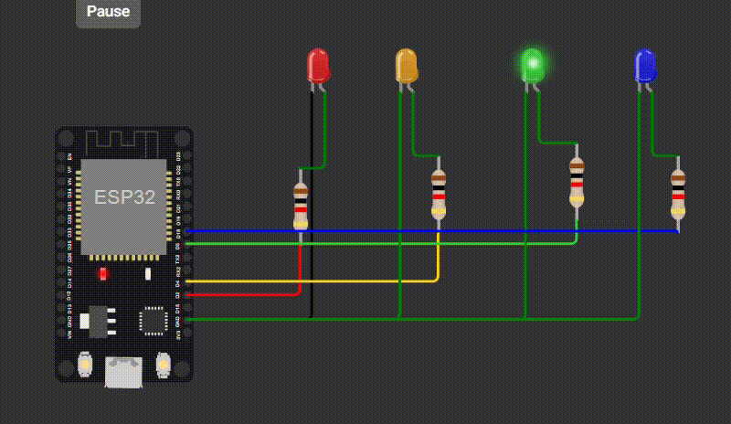

# ESP32 Knight Rider

A Knight Rider-style LED sequence implemented using an ESP32 and four LEDs.

A single LED moves back and forth across the row every 500 milliseconds.

## Hardware

* ESP32
* 4 LEDs
* 4 resistors

## Concepts Practiced

* GPIO output
* Arrays
* `for` loops
* Bit shifting (`<<`, `>>`)
* `millis()` for non-blocking timing
* `constexpr`
* State tracking

## How It Works

The LEDs are stored in an array and controlled individually using `digitalWrite()`.

The program keeps track of the currently active LED and changes its position every 500 milliseconds.

When the active LED reaches one end of the row, the direction is reversed, creating the back-and-forth Knight Rider effect.

Only one LED is turned on at a time.

## Demo

