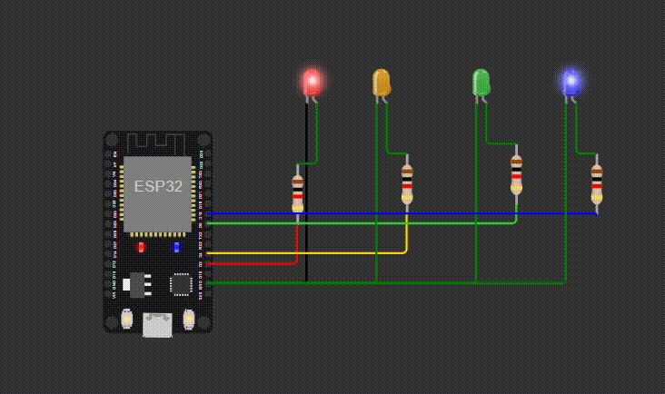

# ESP32 LED Sequence

A predefined LED sequence implemented using an ESP32 and four LEDs.

Every 500 milliseconds, the program displays the next pattern in the sequence. Each number in the sequence represents a 4-bit LED pattern.

## Hardware

* ESP32
* 4 LEDs
* 4 resistors

## Concepts Practiced

* GPIO output
* Arrays
* Binary representation
* Bitwise AND (`&`)
* Bit shifting (`<<`)
* Bit masks
* `millis()` for non-blocking timing
* `constexpr`
* Array indexing

## How It Works

The LED patterns are stored as decimal values in an array:

```cpp
constexpr int Sequence[] = {
    9, 6, 15, 0, 5, 10
};
```

Each value represents a 4-bit pattern:

| Decimal | Binary |
| ------: | :----: |
|       9 | `1001` |
|       6 | `0110` |
|      15 | `1111` |
|       0 | `0000` |
|       5 | `0101` |
|      10 | `1010` |

For each LED, the program checks whether the corresponding bit is set using:

```cpp
Sequence[index] & (1 << i)
```

If the bit is set, the corresponding LED is turned on. Otherwise, it is turned off.

Every 500 milliseconds, the program moves to the next pattern. After the final pattern is displayed, the index returns to the beginning and the sequence repeats.

## Demo


